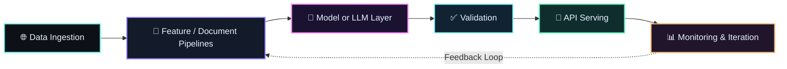

<div align="center">


[](https://git.io/typing-svg)


</div>

<div align="center">

<a href="https://github.com/kiruba11k"></a>
<a href="https://www.linkedin.com/in/kirubakaranperiyasamy/"></a>
<a href="mailto:kiruba11geo@gmail.com"></a>

</div>

---

##  About Me

I design AI systems that run reliably in production environments, integrating **LLMs, retrieval pipelines, deep learning models, and scalable APIs** into measurable business workflows. My focus is building robust solutions from **data ingestion to deployment**, with strong emphasis on **automation impact, model quality, and real-world reliability**.

- Built and deployed GenAI automation tools reducing manual workflow effort by ~40%.
- Developed multi-source data pipelines (10+ sources) to accelerate ML-ready data preparation.
- Specialized in LLM fine-tuning (SFT / LoRA / QLoRA), RAG orchestration, and agentic systems.

---

##  Tech Stack Grid

<div align="center">

### Languages


### Frameworks & Libraries


### AI / ML / GenAI


### Databases & Vector Stores


### Cloud & DevOps


</div>

---

##  Featured Projects

<table>
<tr>
<td width="50%">

### Autonomous AI Research Agent
Autonomous multi-agent loop for planning, retrieval, synthesis, and report generation with minimal human intervention.

**Stack:** `LangGraph` `OpenAI` `ChromaDB` `RAG` `Prompt Engineering`

<a href="https://github.com/kiruba11k?tab=repositories"></a>

</td>
<td width="50%">

### Enterprise Document Q&A (RAG)
Production RAG pipeline with chunking, embeddings, re-ranking, and citation-grounded answer generation.

**Stack:** `LangChain` `ChromaDB` `HuggingFace Embeddings` `GPT-4o`

<a href="https://github.com/kiruba11k?tab=repositories"></a>

</td>
</tr>
<tr>
<td width="50%">

### Customer Churn Prediction
End-to-end ML lifecycle from EDA and feature engineering to explainable deployment; achieved **92% AUC-ROC**.

**Stack:** `XGBoost` `Scikit-learn` `SHAP` `FastAPI` `Docker`

<a href="https://github.com/kiruba11k?tab=repositories"></a>

</td>
<td width="50%">

### Sentiment Analysis & Topic Modelling
Fine-tuned BERT sentiment classifier with **91.8% F1**, paired with LDA topic intelligence and interactive dashboarding.

**Stack:** `BERT` `HuggingFace` `LDA` `Plotly` `FastAPI`

<a href="https://github.com/kiruba11k?tab=repositories"></a>

</td>
</tr>
<tr>
<td width="50%">

### LLM Fine-Tuning with LoRA / QLoRA
Memory-efficient fine-tuning of Mistral-7B with ~70% GPU memory savings versus full fine-tuning workflows.

**Stack:** `PEFT` `QLoRA` `Mistral-7B` `PyTorch` `W&B`

<a href="https://github.com/kiruba11k?tab=repositories"></a>

</td>
<td width="50%">

### OCR + NLP Entity Extraction System
Production OCR-to-entity extraction pipeline for contact intelligence from unstructured images.

**Stack:** `spaCy` `Mistral 24B` `Streamlit` `NLP Pipelines`

<a href="https://github.com/kiruba11k?tab=repositories"></a>

</td>
</tr>
</table>

### 🚀 All GitHub Projects

<div align="center">

<a href="https://github.com/kiruba11k?tab=repositories"></a>


</div>

---

##  GitHub Analytics

<div align="center">


</div>

---

##  System Design & AI Expertise

<div align="center">



</div>

- **RAG Systems:** Document chunking, embedding, vector retrieval, cross-encoder re-ranking, citation-grounded responses.
- **LLM Applications:** SFT workflows, LoRA/QLoRA adaptation, prompt engineering, agentic orchestration with LangGraph.
- **ML Pipelines:** EDA, feature engineering, supervised training, evaluation (precision / recall / F1 / AUC), explainability with SHAP.
- **Backend Scalability:** FastAPI and Django REST services, containerized deployment, modular microservice-style AI integrations.

---

##  Experience Timeline

- **AI / ML Engineer — LeadStrategus** | *Apr 2025 – Present*  
  Built and shipped production ML/GenAI solutions, including automation workflows, LLM fine-tuning pipelines, OCR+NLP systems, and agentic chat architectures.

- **Data Analyst — Abhyaz** | *Oct 2024 – Nov 2024*  
  Worked on analytical workflows, data handling, and business insight generation.

- **Django Developer — Tecosys** | *Aug 2024 – Sep 2024*  
  Led backend delivery for Cerina GPT with 8+ REST APIs and AI integration-ready service design.

- **AWS Cloud Intern — OneData Software Solutions** | *Jul 2022 – Aug 2022*  
  Built foundational cloud infrastructure knowledge across EC2, S3, Lambda, IAM, VPC, and deployment operations.

---

##  Achievements & Certifications

- Machine Learning & Deep Learning with Python — Udemy (Nov 2024)
- Python Web Development — UNICEF (Apr 2024)
- AWS Internship Certification
- Threat Modeling Certification
- AI Workshop Certification
- MySQL Database Development Mastery

---

##  Contact Protocol

<div align="center">

<a href="https://www.linkedin.com/in/kirubakaranperiyasamy/"></a>
<a href="mailto:kiruba11geo@gmail.com"></a>
<a href="https://github.com/kiruba11k"></a>

</div>

<div align="center">

```text
> Designing autonomous intelligence systems for real-world scale.
> Building resilient AI products for the decade ahead.
```

</div>
